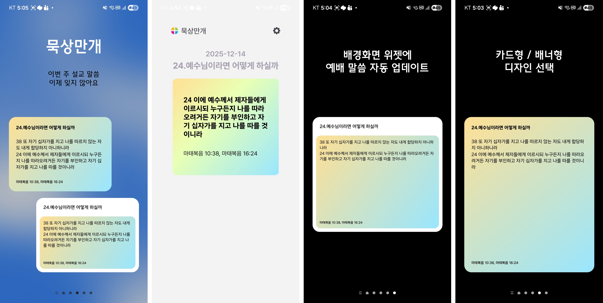

# 묵상만개 App Frontend
### 목차
1. About This App
2. Contribution Guide
3. Setup Guide
4. Related Pages

## 1. About This App

* 앱 이름: 묵상만개 (Meditation Blossom)
* 주 기능: 매 주 교회 설교 말씀을 기억할 수 있도록 휴대폰 바탕화면 위젯에 자동으로 업데이트 해줍니다. 
* 앱 다운로드 페이지
   * [Play store](https://play.google.com/store/apps/details?id=app.mannadev.meditation&pcampaignid=web_share)
   * [App store](https://apps.apple.com/kr/app/%EB%AC%B5%EC%83%81%EB%A7%8C%EA%B0%9C/id6754749244)
* 본 앱은 만나교회 개발자 소모임 [만개하다](https://manna.or.kr/somoim/130539/) 에서 성도님들의 신앙생활에 도움을 드리고자 제작하였습니다. 
* 다른 교회에서도 코드를 수정하여 사용하실 수 있도록 오픈소스로 공개합니다. 앱 수정 및 배포에 관한 내용은 아래 Contribution Guide 를 참고해주세요.

## 2. Contribution Guide
묵상만개 앱은 오픈소스 프로젝트로, 성도님들의 신앙생활에 도움이 되는 기능을 개발하기 위해 자유롭게 수정 및 재배포 하실 수 있습니다.   
묵상만개가 아닌 다른 앱으로 재배포 하실 경우 출처를 표기하고, 코드를 공유해주세요. (GPLv3 License)  
본 리포지토리에 수정사항을 반영하실 때는 아래 내용을 참고해주세요.

1. 브랜치 정책 (Trunk)
   * main: 프로덕션, 개발 브랜치
   * feature/issue_id: 기능 개발, 버그 수정 브랜치
2. Pull Request (PR) 규칙
   * 프로젝트에서 issue 를 생성하고 'feature/issue-##' 브랜치에서 해당 작업을 진행합니다.
   * PR 에 병합할 작업 내용을 작성해주세요.
   * PR 은 최소 1명의 승인이 필요합니다.
   * Squash and Merge 방식으로 병합합니다.
3. 릴리즈 빌드 생성 방법
   * 릴리즈 빌드는 커밋에 버전 태그를 붙이면 GitHub Actions 를 통해 자동으로 생성됩니다.
      ```
      git tag v1.0.0  # 버전 형식: v{major}.{minor}.{patch}
      git push origin v1.0.0
      ```
   * 생성된 릴리즈는 GitHub 저장소의 Releases 페이지에서 확인할 수 있습니다.
   * <details><summary>로컬에서 직접 빌드 하는 방법</summary>
      로컬에서 직접 빌드하기 위해서는 다음 파일들이 필요합니다:
      - `android/app/release.keystore`
      - `android/app/secrets.properties`

      > 💡 위 파일들은 보안상의 이유로 git에 포함되어 있지 않습니다.
      > Discord의 `group-android-widget` 채널에서 파일을 받을 수 있습니다.

      #### 설정 방법

      1. **release.keystore 파일 생성**
      ```bash
      # Discord에서 받은 BASE64_SECRETS_STRING을 사용하여 생성
      echo "$BASE64_SECRETS_STRING" | base64 --decode > android/app/release.keystore
      ```

      2. **secrets.properties 파일 생성**
      ```properties
      # android/app/secrets.properties 파일 생성 후 아래 내용 입력
      STORE_FILE=release.keystore
      STORE_PASSWORD=<비밀번호>
      KEY_ALIAS=<키 별칭>
      KEY_PASSWORD=<키 비밀번호>
      ```

      > ⚠️ 실제 값은 Discord 채널에서 확인하세요.

      #### 빌드 실행
      ```bash
      # 프로젝트 루트 디렉토리에서
      cd android
      ./gradlew bundleRelease  # AAB 파일 생성
      # 또는
      ./gradlew assembleRelease  # APK 파일 생성
      ```

      생성된 파일 위치:
      - AAB: `android/app/build/outputs/bundle/release/app-release.aab`
      - APK: `android/app/build/outputs/apk/release/app-release.apk`

   </details>

## 3. Setup Guide
1. Package Version
2. Mac
3. Window

### 3.1. Package Version (2025. 1. 기준)

| Package 명 | Version | Description |
| :--- | :--- | :--- |
| **Node** | `v18.18.0` | * [React Native 환경 설정 가이드](https://reactnative.dev/docs/0.78/environment-setup)<br>* [Node.js v18.18.0 릴리스 노트](https://nodejs.org/ko/blog/release/v18.18.0) |
| **React Native** | `v0.75` → **`v0.78`** | * 24.08.15 릴리스 기반 (Android SDK 대응을 위해 v0.78로 변경)<br>* Native Code 수정 가능성을 고려하여 **Expo 제외**|
| **Android SDK** | `targetSdk 35`<br>`minSdk 28` | * **targetSdk**: Android 15 (API 35) 수준 사용 (최근 정규 릴리스 적용)<br>* **minSdk**: API 28 (Android 9.0) - 카카오톡 기준과 동일<br>* 2024년 1월 기준 기기의 약 90%가 API 28 이상 사용 중<br>* [Google Play 대상 API 수준 요구사항](https://support.google.com/googleplay/android-developer/answer/11926878?hl=ko) |
| **iOS Version** | `Min 16` | * 최신 4년간 출시 기기의 95%가 iOS 17 이상 사용 중<br>* 전체 기기의 87%가 iOS 17 이상 사용 중<br>* 카카오톡 기준(iOS 16+)에 맞춰 하위 호환성 확보<br>* [App Store 지원 버전 통계](https://developer.apple.com/kr/support/app-store/) |

### 3.2 Mac
<details>
<summary>펼치기</summary>

* 3.2.1. Xcode 설치  
App Store에서 Xcode 검색 후 설치

* 3.2.2. Xcode 라이센스 동의  
```sudo xcodebuild -license accept```

* 3.2.3. Xcode Command Line Tools 설정  
```sudo xcode-select -s /Applications/Xcode.app```

* 3.2.4. Homebrew 설치 (없는 경우)  
```/bin/bash -c "$(curl -fsSL https://raw.githubusercontent.com/Homebrew/install/HEAD/install.sh)"```

* 3.2.5. NVM 설치  
```brew install nvm```

* 3.2.6. 환경 변수 설정  
```~/.zshenv``` 파일에 추가:  
```vim ~/.zshenv```  
아래 내용 복사 후 붙여넣기:
```bash
# NVM 설정
export NVM_DIR="$HOME/.nvm"
[ -s "/opt/homebrew/opt/nvm/nvm.sh" ] && \. "/opt/homebrew/opt/nvm/nvm.sh"
[ -s "/opt/homebrew/opt/nvm/etc/bash_completion.d/nvm" ] && \. "/opt/homebrew/opt/nvm/etc/bash_completion.d/nvm"
```
저장 후 종료 (```:wq```)

* 3.2.7. 설정 반영  
```source ~/.zshenv```

* 3.2.8. Node.js 18.18.0 설치
```
nvm install 18.18.0
nvm use 18.18.0
node -v   # v18.18.0 출력되어야 함
nvm -v
```

* 3.2.9. Ruby 설치 (CocoaPods 용)  
```brew install ruby```  
Ruby PATH 설정
```bash
# Ruby 설정 (CocoaPods용)
export PATH="/opt/homebrew/opt/ruby/bin:$PATH"
export PATH="/opt/homebrew/lib/ruby/gems/4.0.0/bin:$PATH"
```
   저장 후 : 
```bash
source ~/.zshenv
ruby -v   # 3.0 이상이어야 함
```

* 3.2.10. CocoaPods 설치  
```bash
source ~/.zshenv
ruby -v   # 3.0 이상이어야 함
```
터미널 재시작 후:
```bash
pod --version # 설치 확인
```

* 3.2.11. Yarn 설치
```
npm install -g yarn
# 확인
yarn -v
```

* 3.2.12. 프로젝트 의존성 설치
```bash
# 프로젝트 폴더로 이동
cd meditation_blossom_frontend
# Node 모듈 설치
yarn install
# iOS CocoaPods 설치
cd ios
pod install
cd ..
```

* 3.2.13. ios 앱 실행   
```npx react-native run-ios```
   * 첫 빌드 시간: 10 ~ 15분 (정상)
   * 빌드 완료 후 Metro 번들러 자동 실행됨
   * 위젯 확인을 위해서는 실기기 연결 및 Xcode 에서 실행 필요

* 3.2.14. 이후 개발
   * JS/React 코드 수정시 --> 변경사항 자동 반영 (Hot Reload)
   * ```Cmd + R``` --> 수동 새로고침
   * Podfile 수정, 네이티브 모듈 추가 시 --> 앱 재설치 필요 ```npx react-native run-ios```
   

* 3.2.14. React Native / iOS 빌드 에러 해결 방법

| 에러 메시지 | 해결 방법 |
| :--- | :--- |
| `xcodebuild requires Xcode` | `sudo xcode-select -s /Applications/Xcode.app` |
| `iOS devices or simulators not detected` | `sudo xcodebuild -runFirstLaunch` 실행 |
| `command not found: pod` | 터미널 재시작 후 `pod --version` 확인. 안 되면 Ruby PATH 설정 확인 |
| `database is locked` | `rm -rf ~/Library/Developer/Xcode/DerivedData/*` 후 재빌드 |
| `Failed to build ios project` | 1. `cd ios && rm -rf Pods Podfile.lock && pod install && cd ..`<br>2. `rm -rf node_modules && yarn install`<br>3. `npx react-native run-ios` |
| `Ruby 버전이 2.6` | Ruby 3.0 이상 설치 필요  |
| `CocoaPods 설치했는데 pod 명령어 안 됨` | gem bin PATH 추가 필요 (환경 변수 설정 확인) |

</details>

### 3.3. Windows
<details>
<summary>펼치기</summary>

* 3.3.1. Install NVM
   * Download nvm-setup.exe file and execute --> [다운로드 링크](https://github.com/coreybutler/nvm-windows/releases)
   * next ~~~~ and complete
   * Check version , install, use target node version
   ```
   246  nvm -v
   247  nvm ls
   248  nvm install 18.18.0
   249  nvm ls
   250  nvm use 18.18.0
   ```
Reference : [\[Node.js\] 윈도우에서 nvm 설치하기](https://velog.io/@februaar/Node.js-윈도우에서-nvm-설치하기)

* 3.3.2. Make react-native project  
```npx @react-native-community/cli init {{ProjectName}} --version 0.78.0 ```

* 3.3.3. Install JVM
   * Download java 21 and execute --> [다운로드 링크](https://www.oracle.com/java/technologies/downloads/#java21)
   * Set env path  
   [JVM(Java Virtual Machin) 종류와 설치](https://velog.io/@mirrorkyh/JVMJava-Virtual-Machin-%EC%A2%85%EB%A5%98%EC%99%80-%EC%84%A4%EC%B9%98)

* 3.3.4. Install SDK
   * Install “WINDOWS용 SDK 플랫폼 도구 다운로드”  
   [SDK 플랫폼 도구 출시 노트  |  Android Studio  |  Android Developers ](https://developer.android.com/tools/releases/platform-tools?hl=ko)
   * Add env path follow [link](https://designerkhs.tistory.com/48)


* 3.3.5. Install Android Studio
   * Download and execute --> [다운로드 링크](https://developer.android.com/studio?hl=ko)

* 3.3.6. Run app
   * cd to dir
   * 실행
      ``` 
      yarn install
      npx react-native run-android
      ```
* 3.3.7. React Native / android 빌드 에러 해결 방법

| 에러 메시지 | 해결 방법 |
| :--- | :--- |
| A failure occurred while executing com.android.build.gradle.tasks.PackageAndroidArtifact$IncrementalSplitterRunnable | app/debug, app/release, app/build 파일 삭제 후 다 닫고 다시 실행  |
</details>


## 4. Related Pages
* [묵상만개 Firebase](https://console.firebase.google.com/u/0/project/muksang-mangae/overview)
* [Backend Repository](https://github.com/MannaDevelopers/meditation_blossom_firebase) (예배 말씀 크롤러)
* 소모임 페이지 
   * [만개하다 - 만나 개발자 모임](https://manna.or.kr/somoim/130539/)
   * [[2025 만개하다 미니프로젝트]](https://manna.or.kr/somoim/157228/) 
   * [[2026 만개하다 미니프로젝트]](https://manna.or.kr/somoim/190510/)

