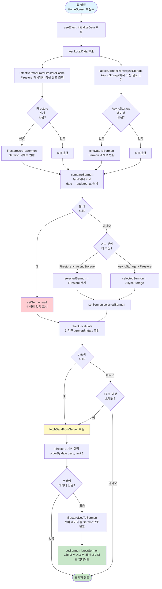
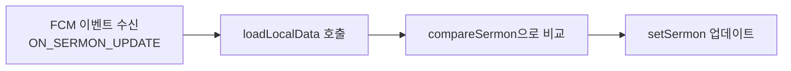
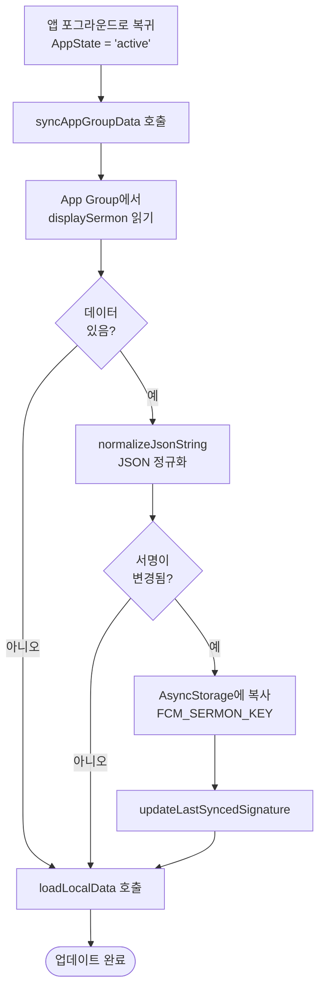
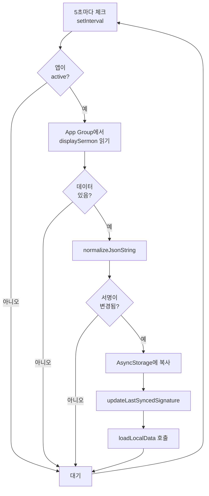
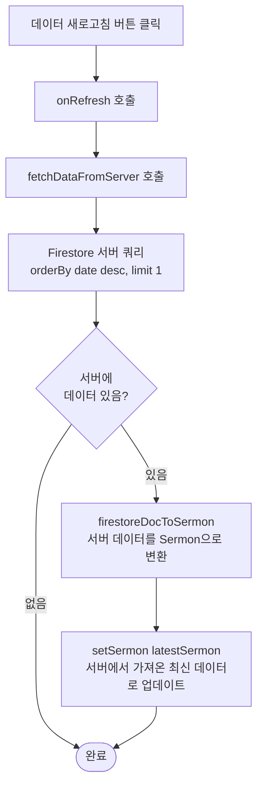

# HomeScreen Sermon Data Selection Flow

## 앱 실행 시 Sermon 데이터 선정 Flow Chart

## 추가 데이터 업데이트 Flow

### 1. FCM 이벤트 수신 시

### 2. 앱 포그라운드 복귀 시 (iOS)

### 3. iOS 주기적 체크 (5초마다)

### 4. SettingsScreen에서 새로고침 버튼 클릭 시

## 주요 함수 설명

### `loadLocalData()`
- **목적**: 로컬 저장소(Firestore 캐시, AsyncStorage)에서 최신 설교 데이터를 로드하고 비교하여 선택
- **반환**: 선택된 `Sermon | null`
- **로직**:
  1. Firestore 캐시에서 최신 설교 조회
  2. AsyncStorage에서 최신 설교 조회
  3. `compareSermon()`으로 두 데이터 비교 (date → updated_at 순서)
  4. 더 최신인 것을 선택하여 `setSermon()` 호출

### `fetchDataFromServer()`
- **목적**: Firestore 서버에서 최신 설교 데이터를 직접 가져옴
- **사용 시점**:
  - 앱 초기화 시 1주일 이상 오래된 데이터인 경우
  - SettingsScreen에서 새로고침 버튼 클릭 시
- **로직**:
  1. Firestore 서버에 쿼리 (date desc, limit 1)
  2. 결과를 `firestoreDocToSermon()`으로 변환
  3. `setSermon()` 호출

### `compareSermon(a, b)`
- **목적**: 두 Sermon 객체를 비교하여 어느 것이 더 최신인지 판단
- **반환**: 
  - `> 0`: a가 더 최신
  - `= 0`: 같음
  - `< 0`: b가 더 최신
- **비교 순서**:
  1. `date` 필드 비교 (문자열)
  2. `date`가 같으면 `updated_at` 필드 비교 (타임스탬프)

### `checkInvalidate(latestSermonDate)`
- **목적**: 선택된 설교 데이터가 1주일 이상 오래되었는지 확인
- **반환**: `boolean` (true면 서버에서 새로 가져와야 함)
- **로직**:
  - date가 null이면 true 반환
  - 현재 날짜 - 7일과 비교하여 오래되었으면 true 반환

## 데이터 소스 우선순위

1. **서버 데이터** (fetchDataFromServer)
   - SettingsScreen 새로고침 시
   - 앱 초기화 시 1주일 이상 오래된 경우

2. **로컬 데이터 비교 결과** (loadLocalData)
   - Firestore 캐시 vs AsyncStorage 중 더 최신인 것
   - FCM 이벤트 수신 시
   - 앱 포그라운드 복귀 시
   - iOS 주기적 체크 시

