# 위젯 디자인 편집 화면 (EditScreen) 기획

- Date: 2026-07-28
- Scope: React Native `EditScreen` 레이아웃/동작 정의. 네이티브(Android Glance / iOS WidgetKit) 반영은 후속 Phase.
- Related: [#169 위젯 디자인 편집](https://github.com/MannaDevelopers/meditation_blossom_frontend/issues/169), [Figma](https://www.figma.com/design/6ypeT4SxOQpiUEANIIhJuT/%EB%AC%B5%EC%83%81%EB%A7%8C%EA%B0%9C)
- 원본 디자인 근거: 소망님이 이슈 #169 코멘트에 첨부한 5장 이미지("편집 메뉴 구성(0418 기준)", 폰트가이드, 여백가이드, 텍스트>색상 2종)
- 세부 옵션(3번 탭) 중 디자이너 확정본이 없는 항목은 이번 라운드에서 기존 확정 스펙(정렬/색상 컴포넌트)과 톤을 맞춰 결정했다. 검토 후 조정 가능.

## 1. Goal

메인 앱의 `EditScreen`에서 현재 표시 중인 위젯(주일 말씀 / 매일 만나)의 텍스트·배경·스타일을 편집하고, 실시간 미리보기로 확인한 뒤 저장할 수 있는 화면의 레이아웃과 동작을 확정한다. 이 문서는 개발 착수 전 UI 스펙 정리가 목적이며, 값의 실제 저장/네이티브 반영 파이프라인은 [#169 구현 난이도 검토](https://github.com/MannaDevelopers/meditation_blossom_frontend/issues/169)에서 별도로 다룬다.

## 2. Non-Goals

- 배경 AI 이미지 — **제외 확정.** 2번 탭 배경 그룹에서 항목 자체를 뺀다 (배경색 / 갤러리 2개만 유지). 관련 UI, 스키마, 스토리지 어디에도 자리를 남기지 않는다.
- 스타일 프리셋(잘보이게/화려하게/심플하게/은은하게) — **제외 확정.** 1번 탭은 텍스트 / 배경 2개로만 구성한다.
- Android/iOS 네이티브 위젯 렌더링 변경 (별도 Phase)
- 다크모드 대응 (하반기 릴리즈 별도 아이템)

## 3. 화면 구조

번호(1번/2번/3번)는 메뉴의 **위계**를 가리키는 것이지 화면상 위치가 아니다. 실제 화면에서는 미리보기 바로 아래에 가장 세부적인 **3번 탭**이 오고, 그 아래 **2번 탭**, 맨 아래에 최상위 카테고리인 **1번 탭**이 온다 (소망님 원본 이미지 기준).

```
[헤더]  ← 뒤로가기         초기화  저장
[미리보기 카드]  305×480, 상단 여백 35, 좌우 여백 35
[3번 탭] (2번 선택에 따른 세부 옵션)       (메뉴마다 개수 다름, 미리보기 바로 아래)
[2번 탭] (1번 선택에 따른 하위 그룹 메뉴)  (텍스트 4 / 배경 2)
[1번 탭] 텍스트 / 배경                    (최상위 카테고리, 2개 고정, 화면 맨 아래, 하단 여백 60)
```

### 3.1 헤더

| 요소 | 스펙 |
|---|---|
| 뒤로가기 | 좌측, 기존 다른 화면과 동일 아이콘. 동작은 4.7절 참고 |
| 초기화 (기본값 복원, 신규 결정) | 저장 버튼 왼쪽, 텍스트 버튼(muted 색상, `bold / 16pt`)으로 저장 버튼과 위계 구분. 문구/동작은 4.6절 참고 |
| 저장 | 우측, `bold / 20pt` |
| 헤더 박스 | 305×20, 위 여백 35 |

### 3.2 미리보기 카드 (배너형/카드형 스와이프, 신규)

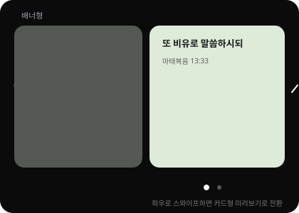

- 박스 305×480, 좌우 여백 35(각각)
- 카드형(Small)과 배너형(Large) 위젯의 실제 형태가 다르고(3.7절 참고), 특히 배경 갤러리 이미지는 위젯 형태마다 스크림 유무·프레이밍이 달라지므로, 편집 중인 디자인이 두 형태 모두에서 어떻게 보이는지 **미리보기 안에서 바로 확인**할 수 있어야 함
- 프레임(305×480) 안에서 좌우 스와이프로 **배너형 ↔ 카드형** 두 페이지를 전환. 기본 진입 페이지는 배너형
- 두 페이지 모두 같은 `draftDesign` 값을 공유하며, 위젯 형태별 렌더링 로직(3.7절)만 다르게 적용됨 — 즉 페이지 전환은 순수 디스플레이 전환이고 별도 편집 상태를 만들지 않음
- 하단에 **페이지 인디케이터**: 점 2개, 현재 페이지는 크고 진하게(8×8, 불투명), 나머지는 작고 흐리게(5×5, 저채도) — 점 자체는 탭 불가, 스와이프로만 전환 (1차 범위)
- 현재 선택된 텍스트/배경 값을 실시간으로 반영 (저장 전에도 편집한 값이 즉시 보여야 함)
- 배경 기본값은 그라데이션 예시 이미지 기준

### 3.3 1번 탭 — 최상위 카테고리 (텍스트 / 배경), 화면 맨 아래

- 개수 2개 (스타일 제외 확정)
- 아이콘 35×35, 아이콘을 감싸는 박스 71×71, 아이템 간 gap 15
- 원본 디자인은 3개 고정 기준으로 좌우 여백 31씩(31 + 71×3 + 15×2 = 305)이었음. 2개로 줄었으므로 같은 총 너비(305)를 유지하도록 좌우 여백을 74씩으로 재계산 (74 + 71×2 + 15 = 305)
- 하단 여백 60
- **선택 상태 표시**: 투명도 있는 흰색 면 (선택된 박스에 반투명 흰 배경)
- 폰트: `bold / 16pt`

### 3.4 2번 탭 — 상위 그룹의 하위 메뉴

1번 탭에서 무엇을 선택했는지에 따라 아래처럼 구성이 바뀐다.

| 1번 탭 | 2번 탭 항목 (개수) |
|---|---|
| 텍스트 | 정렬 / 색상 / 크기 / 두께 (4) |
| 배경 | 배경색 / 갤러리 (2) |

- 아이템 박스 61×40, 좌우 여백 30/40, 상하 여백 15(아래 3번 탭과의 간격) / 40
- **선택 상태 표시**: 선택된 텍스트에 그라데이션 적용, `gradient: #FFCD16 → #FF7E00`, 왼쪽에서 오른쪽 linear
- 폰트: `bold / 16pt`

### 3.5 3번 탭 — 세부 옵션, 미리보기 바로 아래

2번 탭에서 고른 항목에 따라 실제 값을 고르는 최하위 메뉴. 화면상으로는 미리보기 카드 바로 아래에 위치한다.

#### 텍스트 > 정렬 (디자이너 확정)
- 왼쪽 / 가운데 / 오른쪽, 3개
- 아이콘 25×25, 아이콘을 감싸는 원형 55×55, 아이템 간 좌우 여백 7, 좌우 바깥 여백 각 64
- **선택 상태 표시**: 모양(원형)에 선(stroke) 표시

#### 텍스트 > 색상 (디자이너 확정)
- 스와치: 빨강 / 주황 / 노랑 / 초록 / 파랑 / 흰색 / 검정 / 사용자지정(커스텀 컬러피커), 총 8개
- 기본 스와치 크기 30×30, 선택 시 36×36으로 확대 + 체크마크 표시
- 스와치 행 박스 305×90, 좌우 여백 30(각각)
- 색상 선택 즉시 미리보기 텍스트 색상에 반영 (저장 전에도 실시간 적용)

#### 텍스트 > 크기 (신규 결정)

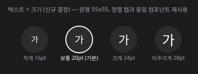

- 정렬 탭과 동일한 원형 55×55 컴포넌트 재사용 (개발 효율 + 일관성)
- 4단계: 작게(16pt) / 보통(20pt, 기본값) / 크게(24pt) / 아주크게(28pt)
- 원 안에 "가" 글자를 실제 비율로 렌더링해 크기를 직관적으로 보여줌
- 선택 상태 표시: 정렬과 동일하게 원형 stroke

#### 텍스트 > 두께 (신규 결정)

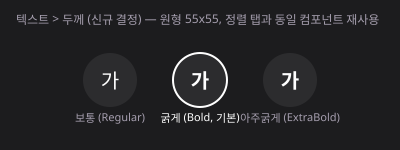

- 동일한 원형 55×55 컴포넌트 재사용
- 3단계: 보통(Pretendard Regular) / 굵게(Pretendard Bold, 기본값) / 아주굵게(Pretendard ExtraBold)
- 선택 상태 표시: 원형 stroke

#### 배경 > 배경색 (신규 결정)

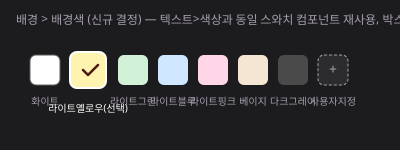

- 텍스트 > 색상과 동일한 스와치 컴포넌트 재사용 (박스 305×90, 30×30 → 선택 시 36×36 확대 + 체크마크)
- 팔레트 8개: 화이트 / 라이트옐로우 / 라이트그린 / 라이트블루 / 라이트핑크 / 베이지 / 다크그레이 / 사용자지정
- 선택 시 미리보기 배경이 그라데이션에서 해당 단색으로 즉시 전환

#### 배경 > 갤러리 (신규 결정)

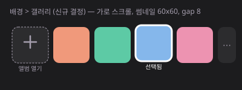

- 가로 스크롤 리스트, 아이템 순서와 의미:
  1. **첫 번째 아이템(점선 테두리 + `+` 아이콘)**: "앨범 열기" 버튼. 탭하면 시스템 이미지 피커(휴대폰 전체 앨범)가 열림
  2. **이후 아이템들**: 기기 사진 앨범의 **최근 사진 썸네일** (목업의 색상 블록은 자리표시일 뿐, 실제로는 진짜 사진 미리보기가 들어감). 매번 전체 앨범을 열지 않고도 최근 찍은 사진 중 바로 고를 수 있는 빠른 선택 경로
- 썸네일 60×60, 아이템 간 gap 8
- 썸네일 탭 → **즉시 배경으로 적용되지 않고 3.6절의 크롭/포지션 조정 화면으로 진입**. 조정 후 "적용"을 눌러야 배경으로 반영됨. 원하는 사진이 최근 목록에 없으면 "앨범 열기"로 전체 앨범에서 다른 사진 선택
- 선택 표시(흰색 stroke)가 있는 썸네일을 다시 탭하면 저장된 줌/포커스 값을 불러온 채로 크롭 화면이 다시 열림 (재조정)
- 이미지 저장/압축 처리는 [#169 구현 난이도 검토](https://github.com/MannaDevelopers/meditation_blossom_frontend/issues/169)에서 "중간" 난이도로 확인됨 (별도 Phase)

### 3.6 배경 갤러리 — 이미지 크롭/포지션 조정 (신규 추가)

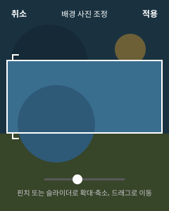

사진과 위젯의 가로세로 비율이 다르면 그대로 채웠을 때 원치 않는 부분이 잘리거나 늘어난다. 사용자가 어느 부분을 보여줄지 직접 정할 수 있는 크롭 화면을 3.5절 "배경 > 갤러리" 썸네일 선택 다음 단계로 추가한다.

#### 화면 구성
- 전체화면 오버레이. 선택한 원본 사진을 배경 전체에 표시
- 중앙에 사각형 **프레임**을 표시. 프레임 비율은 `Large` 위젯의 최소 크기 비율(245:115dp ≈ 2.13:1)을 기준으로 한다 — 근거는 아래 "왜 원본+줌/포커스 값으로 저장하는가" 참고
  - 프레임 안쪽: 원본 밝기 그대로 (실제로 위젯에 보일 영역)
  - 프레임 바깥쪽: 반투명 검정 오버레이로 어둡게 처리 (마스킹 효과) — 흐림(blur) 처리는 실시간 드래그 중 성능 부담이 커서 1차로는 채택하지 않고, 필요 시 후속 검토
  - 프레임 모서리에 코너 마커를 그려 경계를 명확히 함
- 상단: "취소" / "적용" 텍스트 버튼, 가운데 화면 제목
- 하단: 확대/축소 슬라이더(핀치 제스처와 동일한 기능을 손가락 하나로도 쓸 수 있도록 보조 제공) + 안내 문구

#### 제스처
- **핀치 확대/축소**: 두 손가락으로 이미지 확대·축소. 최소 배율은 "이미지가 프레임을 빈틈없이 채우는 지점"(이미지가 프레임보다 작아지는 걸 방지), 최대 배율은 원본 해상도 기준 과도한 화질 저하를 막기 위해 3배로 제한
- **드래그 이동(팬)**: 한 손가락으로 이미지를 움직여 프레임 안에 담길 위치(포커스 포인트) 조정. 프레임은 고정, 이미지가 그 안에서 움직이는 구조(인스타그램 프로필 사진 편집과 동일한 패턴)
- 이미지가 프레임 경계를 벗어나 빈 공간이 생기지 않도록 팬 범위를 제한

#### 왜 "미리 잘라낸 이미지 한 장"이 아니라 "원본 + 줌/포커스 값"으로 저장하는가 — Android 위젯 리사이즈 대응
- `verse_widget_large_info.xml` / `verse_widget_small_info.xml`에 `android:resizeMode="horizontal|vertical"`가 설정돼 있어, 사용자가 홈 화면에서 위젯을 길게 눌러 **가로/세로 크기를 자유롭게 리사이즈**할 수 있다 (`minWidth`/`minHeight` 이상, 상한 없음). 즉 실제 위젯 화면 비율은 에디터에서 크롭한 시점의 비율과 나중에 달라질 수 있다
- iOS는 연속 리사이즈는 없지만 `.systemMedium` / `.systemLarge` 두 개의 고정 비율을 동시에 지원해야 한다 (`MeditationBlossomWidget.swift`)
- 따라서 크롭 결과를 "미리 잘라낸 고정 비트맵 한 장"으로 저장하면, 다른 비율/사이즈에서 다시 여백이 생기거나 잘못 늘어나는 문제가 재발한다
- 대신 **원본 이미지(또는 적당히 다운스케일한 원본) + 줌 배율(`zoom`) + 포커스 포인트(`focalX`, `focalY`, 0~1 정규화 좌표)** 를 저장한다. 각 네이티브 위젯은 실제로 렌더링되는 크기에 맞춰 그 시점의 박스에 이미지를 채우되(Android `ContentScale.Crop`, iOS `.aspectRatio(contentMode: .fill)`), 포커스 포인트를 기준으로 크롭한다 (CSS `object-position`과 동일한 개념)
- 참고로 `Small`(177×115dp)과 `Large`(245×115dp) 위젯은 **`minHeight`가 115dp로 동일**하고 `minWidth`만 다르므로, 하나의 포커스 포인트 기반 크롭 값이 두 사이즈 모두에 비교적 자연스럽게 적용된다 (Large의 좌우가 더 넓게 보일 뿐, 세로 프레이밍은 동일)
- 다만 원본과 목표 위젯 비율 차이가 극단적으로 클 경우, 에디터에서 의도한 프레이밍이 리사이즈 후 완전히 동일하게 보장되지는 않는다는 한계는 남는다. 크롭 화면에 "위젯 크기를 조절하면 배경이 조금 다르게 보일 수 있어요" 안내 문구를 노출해 기대치를 맞춘다
- 네이티브에서 포커스 포인트를 정확히 반영하는 구체적 구현 방식(원본을 그대로 두고 오프셋 렌더링 vs 클라이언트에서 여유 있게 미리 크롭한 중간 이미지를 저장)은 Glance/WidgetKit API 제약 확인이 필요해 Phase 2 기술 검토 항목으로 남긴다

### 3.7 카드형(Small) 위젯 배경 적용 방식 (신규)

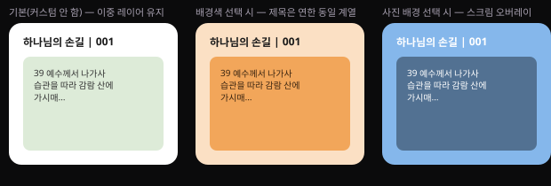

Android 홈 화면 위젯 피커에는 "카드형"(Small, 3×2)과 "배너형"(Large, 4×2) 두 형태가 있고, 실제 코드 구조가 다르다.

- **배너형** ([`VerseWidgetLarge.kt`](../../../android/app/src/main/java/app/mannadev/meditation/ui/widget/VerseWidgetLarge.kt)): 제목·본문·출처가 **단일 배경 카드** 위에 함께 놓임. `WidgetDesign.background`가 그대로 1:1로 적용됨
- **카드형** ([`VerseWidgetSmall.kt`](../../../android/app/src/main/java/app/mannadev/meditation/ui/widget/VerseWidgetSmall.kt)): **이중 레이어** 구조. 바깥은 흰 배경(`Color.White`) 위에 제목만 있고, 그 아래 별도의 둥근 박스(`.xmlGradientBackground()`)가 본문을 담음. 배경 디자인을 그대로 적용하면 "본문 카드만 바뀌고 제목은 계속 흰 배경"인 반쪽짜리 결과가 됨

#### 결정: 배경 타입에 따라 카드형의 이중 레이어를 다르게 재해석한다

| 배경 타입 | 카드형(Small) 적용 방식 |
|---|---|
| 배경색(단색) | 제목 영역과 본문 카드를 **같은 색으로 완전히 통일하지 않는다** — 배너형과 구분이 안 될 정도로 똑같아지는 걸 피하기 위해, 두 레이어 구조는 유지하되 **제목 영역은 배경색보다 연한 동일 계열 색**을 쓴다. 본문 카드는 사용자가 고른 색 그대로, 제목 영역은 그 색의 HSL 명도(L)를 +18%p 올린(95% 상한 clamp) 톤 — 색조·채도는 유지한 채 같은 계열의 밝은 버전 |
| 배경 갤러리(사진) | 사진을 위젯 전체 배경으로 깔고, 기존에 본문을 감싸던 "그라데이션 카드" 자리를 **반투명 검정 스크림**(약 38% 불투명도)으로 재해석. 카드 구조 자체는 그대로 재활용하되 용도만 장식 → 가독성 보정 레이어로 바뀜. 제목은 스크림 밖(사진 위에 직접)에 있으므로 옅은 텍스트 그림자를 추가해 사진이 밝아도 읽히도록 보정 |
| 커스터마이징 안 함(기본값) | 지금 그대로 유지 — 흰 배경 + 고정 그라데이션 카드 |

- 사용자는 형태별로 별도 설정을 하지 않는다. 하나의 `WidgetDesign`이 배너형/카드형 양쪽에 자동으로 알맞게 렌더링되고, 3.2절의 스와이프 미리보기로 두 결과를 바로 확인할 수 있다
- 배경색의 "연한 톤" 계산은 프리셋 8종과 사용자 지정 색 모두에 동일한 공식(HSL L값 +18%p, 95% 상한)을 적용하므로, 팔레트별로 별도 값을 미리 정의해둘 필요가 없다. 흰색처럼 이미 밝은 색은 사실상 변화가 없어 제목/본문이 거의 같아 보이는데, 이는 자연스러운 결과로 허용한다
- 이미지 크롭(3.6절)의 포커스 포인트도 동일하게 재사용: Small/Large가 `minHeight`를 공유하므로 스크림 안쪽 콘텐츠 영역 기준으로 크롭해도 두 형태에서 크게 어긋나지 않음
- 텍스트 색상은 사용자가 3.5절에서 직접 고르므로, 사진이 밝든 어둡든(또는 배경색의 연한 제목 영역이든) 최종 대비는 사용자 선택에 달려 있음 — 스크림/톤 조정은 "최소한의 가독성 보정"이지 완전한 대비 보장 장치는 아니라는 점을 문서화해둔다

### 3.8 화면 조합 예시 (6종)

1번/2번/3번 탭을 실제로 조합했을 때 화면이 어떻게 보이는지 6가지 케이스로 그려봄. 번호 위계와 화면상 위치(3번이 위, 1번이 아래)를 함께 확인할 수 있다.

| 텍스트 > 정렬 | 텍스트 > 색상 | 텍스트 > 크기 |
|---|---|---|
| 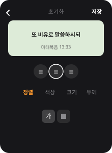 | 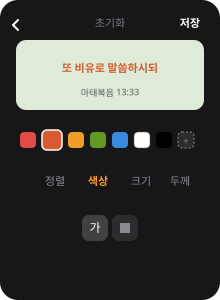 | 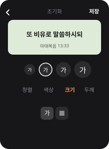 |

| 텍스트 > 두께 | 배경 > 배경색 | 배경 > 갤러리 |
|---|---|---|
| 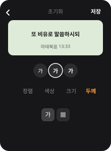 | 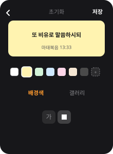 | 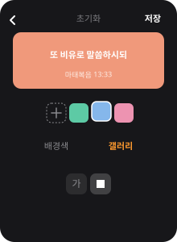 |

## 4. 인터랙션 동작 (확정)

### 4.1 탭 전환
- 1번 탭 전환 → 2번 탭 목록이 즉시 교체 (애니메이션 없이, 기존 EditScreen 스켈레톤과 동일)
- 2번 탭 전환 → 3번 탭 목록이 즉시 교체

### 4.2 미리보기 배너형/카드형 스와이프 전환 (3.2절, 신규)
- 미리보기 프레임을 좌우로 스와이프하면 배너형 ↔ 카드형 페이지가 전환됨
- 페이지 전환은 순수 디스플레이 동작이며 `draftDesign` 등 편집 상태에는 어떤 영향도 주지 않음
- 하단 페이지 인디케이터는 현재 페이지에 따라 자동으로 갱신 (탭 인터랙션 없음, 1차 범위)
- 1·2·3번 탭에서 값을 바꾸는 동안에도 현재 보고 있던 페이지(배너형 또는 카드형)가 유지됨

### 4.3 값 선택 → 실시간 미리보기
- 3번 탭에서 값을 고르면 미리보기 카드에 즉시 반영 (현재 스와이프로 보고 있는 페이지 기준으로 반영되어 보임)
- 값은 화면 로컬 상태(`draftDesign`)에만 저장되고, 실제 위젯에는 저장 버튼을 눌러야 반영됨

### 4.4 저장
- 로컬 상태(`draftDesign`)를 실제 디자인 설정으로 커밋 → 네이티브 위젯에 반영 (구현은 [#169] Phase 2)
- 저장 완료 후 이전 화면으로 복귀

### 4.5 배경 이미지 크롭/포지션 조정 (3.6절)
- 갤러리 썸네일(또는 앨범 열기로 새로 고른 사진) 탭 → 크롭 화면 진입. `draftDesign`과는 별개의 임시 편집 상태(`draftImageTransform`)로 다룸
- 크롭 화면 "적용" → `draftImageTransform`을 `draftDesign.background.imageTransform`에 반영하고 크롭 화면 닫힘, EditScreen 미리보기에 즉시 반영 (다른 저장 동작과 동일하게 실제 위젯 반영은 EditScreen "저장"을 눌러야 함)
- 크롭 화면 "취소" → `draftImageTransform` 폐기, 이전에 적용돼 있던 배경(다른 갤러리 사진이었다면 그 값, 처음 선택이었다면 배경 없음)으로 되돌아감. **EditScreen의 다른 변경사항(텍스트 설정 등)에는 영향 없음**
- 이미 배경으로 적용된 썸네일을 다시 탭하면 저장된 `zoom`/`focalX`/`focalY` 값을 그대로 불러온 채 크롭 화면이 열림 (재조정)

### 4.6 초기화 (기본값 복원)
- 헤더 "초기화" 버튼 탭 → 확인 다이얼로그 노출
  - 제목: "기본값으로 되돌릴까요?"
  - 본문: "지금까지 편집한 내용이 모두 사라집니다."
  - 버튼: "취소" / "되돌리기"
- "되돌리기" 선택 시 `draftDesign`을 초기 기본값(`DEFAULT_WIDGET_DESIGN`)으로 리셋하고 미리보기에 즉시 반영. 저장 버튼을 눌러야 실제 위젯에 반영됨 (전체 지우기 컨펌 패턴과 동일, [#174](https://github.com/MannaDevelopers/meditation_blossom_frontend/issues/174) 참고)

### 4.7 화면 이탈 (뒤로가기 / 헤더 백버튼 / OS 스와이프 백)
- `draftDesign`이 저장된 값과 다르면(변경사항 있음) 이탈 시도 시 확인 다이얼로그 노출
  - 제목: "변경사항을 저장하지 않았습니다"
  - 본문: "지금 나가면 편집한 내용이 사라집니다."
  - 버튼: "계속 편집" (다이얼로그만 닫고 화면 유지) / "나가기" (변경사항 폐기 후 이전 화면으로 이동)
- `draftDesign`이 저장된 값과 동일하면(변경사항 없음) 다이얼로그 없이 바로 이전 화면으로 이동

## 5. 시스템 글씨 크기(접근성) 대응

텍스트 > 크기(3.5절) 4단계(16/20/24/28pt)는 사용자가 위젯 안에서 직접 고르는 **디자인 값**이다. 이와 별개로 OS에는 사용자가 전역으로 설정하는 **시스템 글씨 크기**(iOS 손쉬운 사용 텍스트 크기 / Android 글꼴 크기)가 있고, 두 값이 그대로 곱해지면 원치 않는 문제가 생긴다.

### 5.1 문제 확인

- Android 위젯은 현재 `Type.kt`에서 텍스트 크기를 전부 `sp` 단위로 정의하고 있음 (`18.sp`, `14.sp` 등). `sp`는 Android 시스템 글꼴 크기 설정에 따라 자동으로 배율이 곱해진다. 즉 오늘 기준으로도 시스템 글꼴 크기를 키우면 기존 위젯 텍스트가 함께 커지고 있음
- 위젯은 홈 화면에 배치된 고정 크기 박스라 텍스트 영역이 넉넉하지 않다. 여기에 (a) 사용자가 고른 디자인 크기(예: 아주크게 28pt) + (b) 시스템 글꼴 확대(예: 200%)가 곱해지면 텍스트가 잘리거나 위젯 밖으로 넘치는 문제가 생길 수 있음
- iOS는 현재 `MeditationBlossomWidget.swift`에서 `.font(.system(size: 18, weight: .bold))`처럼 고정 포인트 크기를 쓰고 있어 SwiftUI Dynamic Type 자동 확대 대상이 아님 (이름 있는 텍스트 스타일 `.body`, `.title` 등을 쓸 때만 자동 확대됨). 그래서 iOS는 오늘 기준으로 이미 시스템 글씨 크기 영향을 받지 않는 상태

### 5.2 정책 (확정)

- **위젯에 실제로 렌더링되는 텍스트(제목/본문)는 사용자가 고른 디자인 크기값을 절대 pt로 고정 적용하고, 시스템 글씨 크기 설정은 무시한다.** 위젯 공간이 제한적인 상황에서 두 배율이 곱해지는 걸 막고, "에디터에서 본 대로 위젯에 나온다(WYSIWYG)"를 보장하기 위함
  - Android: 위젯 텍스트를 `sp` 대신 `dp` 기반 고정 크기로 전환하거나, Compose `LocalDensity`를 `fontScale = 1f`로 오버라이드해서 렌더링 (기존 `sp` 기반 동작에서 바뀌는 부분이라 Phase 2 네이티브 작업 시 QA로 확인 필요)
  - iOS: 이미 `.font(.system(size:))` 고정값이라 별도 대응 불필요. 유지만 하면 됨
- **EditScreen(RN)의 미리보기 콘텐츠 텍스트와 "가" 크기 선택 버튼도 동일하게 시스템 글씨 크기 설정을 무시**하도록 `allowFontScaling={false}`를 적용한다 (실제 위젯과 동일하게 보여야 하므로)
- **단, EditScreen의 UI 크롬(헤더의 "저장"/"초기화", 1·2번 탭 라벨, 안내 문구 등)은 시스템 글씨 크기 설정을 그대로 따른다** (`allowFontScaling` 기본값 유지) — 편집 대상이 아닌 일반 UI는 접근성을 지켜야 하므로
- 텍스트 길이가 위젯 표시 가능 영역을 넘는 경우의 처리는 기존 동작을 유지한다: Android 본문 영역은 기존처럼 스크롤 가능한 `LazyColumn`으로 흡수하고, iOS는 기존 `lineLimit`(Large 9줄 / Medium 4줄)으로 말줄임 처리. 제목은 두 플랫폼 모두 기존 `maxLines`/`lineLimit(2)` 유지

## 6. 데이터 스키마

```ts
type WidgetTextAlign = 'left' | 'center' | 'right';
type WidgetTextSize = 16 | 20 | 24 | 28; // 작게/보통/크게/아주크게
type WidgetTextWeight = 'regular' | 'bold' | 'extrabold';
type WidgetBackgroundType = 'color' | 'gallery';

interface WidgetImageTransform {
  zoom: number; // 1.0 = 이미지가 프레임을 빈틈없이 채우는 최소 배율, 최대 3.0
  focalX: number; // 0~1, 이미지 가로축에서 프레임 중심이 위치하는 지점
  focalY: number; // 0~1, 이미지 세로축에서 프레임 중심이 위치하는 지점
}

interface WidgetDesign {
  text: {
    align: WidgetTextAlign;
    color: string; // hex, 프리셋 8종 중 하나 또는 커스텀
    size: WidgetTextSize;
    weight: WidgetTextWeight;
  };
  background: {
    type: WidgetBackgroundType;
    value: string; // type='color'면 hex, type='gallery'면 원본(또는 다운스케일) 이미지 로컬 경로
    imageTransform?: WidgetImageTransform; // type='gallery'일 때만 존재 (3.6절)
  };
}

const DEFAULT_WIDGET_DESIGN: WidgetDesign = {
  text: { align: 'center', color: '#000000', size: 20, weight: 'bold' },
  background: { type: 'color', value: 'gradient-default' }, // 기존 미리보기 그라데이션 배경 유지
};
```

## 7. File Change Checklist (React Native, Phase 1)

- [ ] `src/screens/EditScreen.tsx` — 3단 탭 상태를 실제 `WidgetDesign` 값(`draftDesign`)으로 연결, 여백/사이즈를 위 스펙대로 조정, 헤더에 초기화 버튼 추가, 이탈 확인 다이얼로그 연결
- [ ] `src/components/WidgetPreview.tsx` — `design: WidgetDesign` prop 추가, 실시간 스타일 반영, 미리보기 텍스트/크기 선택 버튼에 `allowFontScaling={false}` 적용 (5절)
- [ ] `src/types/WidgetDesign.ts` (신규) — 6절 스키마 + `DEFAULT_WIDGET_DESIGN` 정의
- [ ] `src/constants/index.ts` — 텍스트 색상 프리셋 8종, 배경색 프리셋 8종 상수 추가
- [ ] 화면 이탈 컨펌: `beforeRemove` 네비게이션 이벤트로 처리 (React Navigation `usePreventRemove` 또는 `beforeRemove` 리스너)
- [ ] `src/screens/ImageCropScreen.tsx` (신규, 3.6/4.5절) — 전체화면 크롭 오버레이, 마스킹 프레임, 핀치/드래그 제스처, 확대·축소 슬라이더
- [ ] `src/components/WidgetPreview.tsx` (연장) — 배너형/카드형 스와이프 페이저 + 페이지 인디케이터 추가 (3.2/4.2절), 카드형 렌더링 시 배경 타입별 스크림 로직(3.7절)을 RN 미리보기에도 동일하게 반영
- [ ] 이미지 피커 라이브러리 도입 검토 — 현재 `package.json`에 이미지 피커/크롭 라이브러리가 없음. `react-native-image-picker`(시스템 피커) + 크롭은 자체 구현(제스처 기반) 또는 검증된 크롭 라이브러리 선택
- [ ] 핀치/드래그 제스처 성능 검토 — `react-native-gesture-handler`는 이미 의존성에 있음(기존 네비게이션에서 사용 중). 부드러운 확대/이동을 위해 `react-native-reanimated` 추가 도입 여부 검토
- [ ] 네이티브 브릿지 연동은 본 문서 범위 밖 ([#169] Phase 2 참고). 단, Android `Type.kt`의 `sp` → 고정 크기 전환(5.2절), 배경 이미지의 포커스 포인트 기반 크롭 렌더링(3.6절)은 Phase 2 착수 시 반드시 반영
